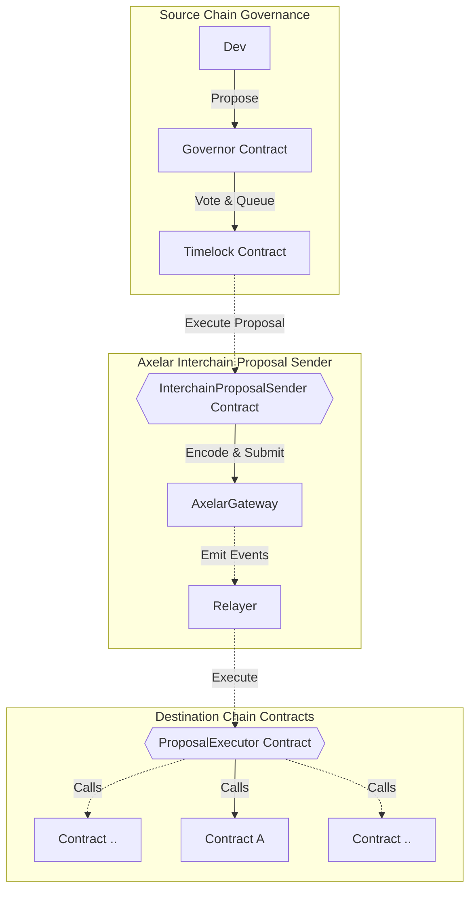

# Axelar Interchain Governance

Axelar Interchain Governance is a project that enhances on-chain governance protocols to facilitate interchain proposal execution. We demonstrate the extension using Compound's governance contracts, but the approach can be applied to any governance protocol.

## Key Components

There are two essential contracts in this interchain extension:

1. `InterchainProposalSender`: Deployed on the source chain, this contract has a method called `broadcastProposalToChain`. This method encodes a proposal into a payload for a remote chain and pays the Axelar Gas Service for the execution of the interchain call on the destination chain.

2. `ProposalExecutor`: Deployed on the destination chain, this contract has a callback method `_execute` that executes the proposal on the target contracts.

For a visual transaction flow of the interchain proposal, see the mermaid diagram below.



## Getting Started

Get up and running with integrating your governance system using Axelar. Here are a few approaches to help you understand the process:

### 1. Local Testing

To get a feel for the process, start by running local tests. This will help you understand the expected behavior of the system:

```shell
yarn install
yarn test
```

### 2. Code Review and Experimentation

Understand the codebase better by checking out our sample code. It provides an example of creating a proposal, such as updating a state variable in the [DummyState.sol](contracts/test/DummyState.sol) contract on `Avalanche` from `Ethereum`. You can find this in [sample.md](docs/sample.md).

### 3. Integration

Once you're comfortable with the process, use the deployed addresses to integrate your governance system with Axelar.

## Interchain Proposal Execution

In order to execute interchain proposals, deploy your instance of `InterchainProposalSender`. Alternatively, use our predefined contract for the testnet listed below. On the destination chain, deploy `ProposalExecutor` and set up access control for whitelisted senders from the source chain.

| Chain     | InterchainProposalSender address           |
| --------- | ------------------------------------------ |
| Avalanche | 0xAD41b0B7385380Ca032cB3aF121Ef3E525550aE4 |
| Ethereum  | 0xAD41b0B7385380Ca032cB3aF121Ef3E525550aE4 |
| Polygon   | 0xAD41b0B7385380Ca032cB3aF121Ef3E525550aE4 |
| Moonbeam  | 0xAD41b0B7385380Ca032cB3aF121Ef3E525550aE4 |
| Fantom    | 0xAD41b0B7385380Ca032cB3aF121Ef3E525550aE4 |

## Deployment Guide

To learn more about the deployment process, please follows [this guide](docs/deployment.md)
