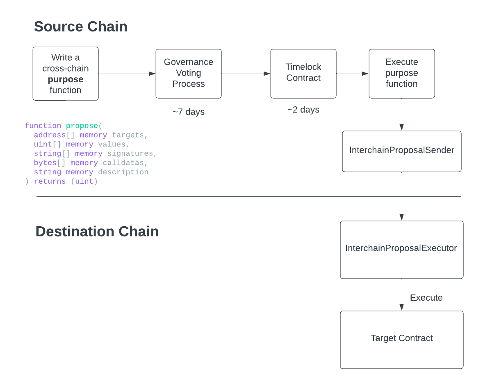

# Axelar Crosschain Governance

This project takes a representative on-chain governance protocol and extends its functionality to be able to execute a cross-chain proposal, once that proposal has been passed on the protocol on the source chain. The example used here builds on top of the `Compound` governance protocol, but with the following implementation below, the concepts can apply to any governance protocol.

The cross-chain extension of the protocol will require two contracts:

- `InterchainProposalSender` to be deployed on the source chain. It will include the method, `executeRemoteProposal`, that
  1. encodes the proposal into a payload to be sent to a remote chain for execution (once the proposal has been approved on the source chain), and
  2. pays the Axelar Gas Service the requisite amount of gas for automated execution of the cross-chain call on the destination chain
- `InterchainProposalExecutor` is an `AxelarExecutable` to be deployed on the destination chain. The `_execute` method is the callback invoked that executes the passed proposal on the target contracts

The diagram below is an indicative transaction flow for the execution of the cross-chain proposal:



## Set up and run the local end-to-end tests

```shell
yarn install
yarn test
```

## Execute your own cross-chain proposal

You can either deploy your own instance of `InterchainProposalSender` or use our existing instantiations here:

### Testnet

| Chain     | InterchainProposalSender address |
| --------- | -------------------------------- |
| Avalanche | 0xTBD                            |
| Ethereum  | 0xTBD                            |
| Polygon   | 0xTBD                            |
| Moonbeam  | 0xTBD                            |
| etc       | 0xTBD                            |

You will then need to deploy your own instance of `InterchainProposalExecutor` that sets up access control for whitelisted sender of messages incoming from the source chain.

Once your contracts are deployed, you could craft your proposal to invoke the `executeInterchainProposal` method on the `InterchainProposalSender` contract on the source chain that will then execute your callback inside the `_execute` function of the `InterchainProposalExecutor` method on the destination chain.

Let's say you want to introduce a proposal on Ethereum to change the value of a state variable `string` on the `DummyContract.sol` contract deployed on Avalanche to a new value "Hello World".

The proposal would be written on Ethereum as follows:

```typescript
import { Contract, Wallet } from "ethers";

const senderABI = [
  "constructor(address _gateway, address _gasService)",
  "function executeRemoteProposal(string destinationChain, string destinationContract, bytes payload)",
];
const governorAlphaABI = [
  "constructor(address timelock_, address comp_, address guardian_)",
  "function propose(address[] targets, uint256[] values, string[] signatures, bytes[] calldatas, string description)",
];
const DummyContractAddressOnAvalanche = "0xDUMMY_CONTRACT_ADDRESS_ON_AVALANCHE";
const InterchainProposalExecutorAddressOnAvalanche =
  "0xINTERCHAIN_PROPOSAL_EXECUTOR_ADDRESS_ON_AVALANCHE";
const GovernorAlphaAddressOnEthereum = "0xGOVERNOR_ALPHA_ADDRESS_ON_ETHEREUM";
const InterchainProposalSenderAddressOnEthereum =
  "0xINTERCHAIN_PROPOSAL_SENDER_ADDRESS_ON_ETHEREUM";

async function createProposal() {
  const signer = Wallet.fromMnemonic("YOUR_EVM_PRIVATE_KEY");
  const governorAlphaContract = new Contract(
    GovernorAlphaAddressOnEthereum,
    governorAlphaABI,
    signer
  );
  const sender = new Contract(
    InterchainProposalSenderAddressOnEthereum,
    senderABI,
    signer
  );

  // Encode the payload for the destination chain
  const proposalPayload = ethers.utils.defaultAbiCoder.encode(
    ["address[]", "uint256[]", "string[]", "bytes[]"],
    [
      [DummyContractAddressOnAvalanche],
      [0],
      ["setState(string)"],
      [ethers.utils.defaultAbiCoder.encode(["string"], ["Hello World"])],
    ]
  );

  // Propose the payload to the Governor contract
  await governorAlphaContract.propose(
    [sender.address],
    [ethers.utils.parseEther("0.0001")],
    ["executeRemoteProposal(string,string,bytes)"],
    [
      ethers.utils.defaultAbiCoder.encode(
        ["string", "string", "bytes"],
        [
          "Avalanche",
          InterchainProposalExecutorAddressOnPolygon,
          proposalPayload,
        ]
      ),
    ],
    { value: ethers.utils.parseEther("0.0001") }
  );
}

createProposal();
```

The `createProposal` method above creates a proposal in the `GovernorAlpha` contract to invoke the `executeRemotePayload` function on the `InterchainProposalSender` contract on Ethereum that would call a cross-chain method sent cross-chain. This specific proposal is to call the `setState` method on the `DummyContract.sol` contract on `Avalanche`, setting the new value to "Hello World".

After the proposal is created, it follows the normal governance procedures in the Compound `GovernorAlpha` contracts. Specifically:

1. The proposal is open for a (configurable) 7-day voting period.
2. If the proposal passes, it is queued in a timelock contract for a (configurable) period of ~two days, a period in which it can also be cancelled. It can be queued as follows:

```typescript
const proposalId = await governorAlpha.latestProposalIds(signer.address);
await governorAlpha.queue(proposalId);
```

3. If the approved proposal is not cancelled after the ~two-day period, the proposal can be executed on the timelock contract by calling the `execute` method on the `GovernorAlpha` contract on Ethereum. Note that the (payable) `execute` function must be paid enough gas for the cross-chain call. The execute method could be invoked as follows:

```typescript
import {
  CHAINS,
  Environment,
  AxelarQueryAPI,
} from "@axelar-network/axelarjs-sdk";

const axelarJsApi = new AxelarQueryAPI({ environment: Environment.MAINNET });
const proposalId = await governorAlpha.latestProposalIds(signer.address);

const crossChainRelayerFee = await axelarJsApi.estimateGasFee(
  CHAINS.MAINNET.ETHEREUM,
  CHAINS.MAINNET.AVALANCHE,
  GasToken.ETH,
  5_000_000, // See (A) below
  1.2,
  undefined
);

await governorAlpha.execute(proposalId, {
  value: crossChainRelayerFee,
});

// (A): You need to ensure you pass an sufficient gas limit estimate for the execution of your transaction on the destination chain.
```

## Deployment Guide

Please follows [this guide](docs/deployment.md)
